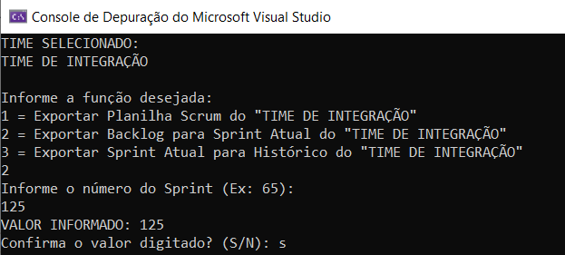
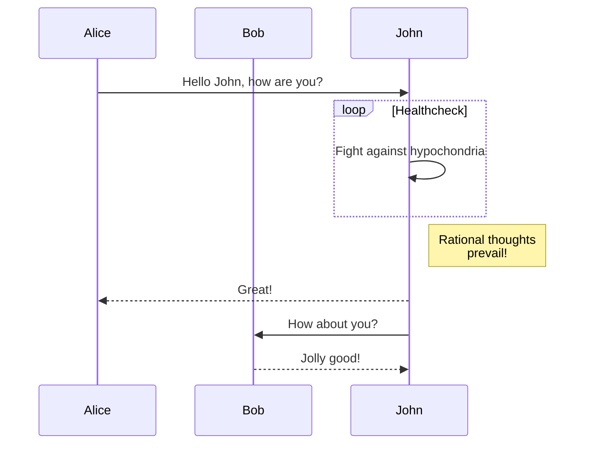

# Regras Gerais
- Se a imagem for um código (XML, C#, SQL, etc..), dê preferência para o [code block do markdown](https://www.markdownguide.org/extended-syntax/#fenced-code-blocks). Além de evitar o trabalho de fazer o upload de imagem, ajuda o desenvolvedor a copiar e colar o código.
- Caso use code block, tente colocar [Syntax Highlight](https://www.markdownguide.org/extended-syntax/#syntax-highlighting)
- Caso queria colocar **fluxogramas**, use o código [mermaid](https://mermaid.js.org/#/).

# Incluir imagem a partir do editor do Gitlab
- Abrir a página desejada para inclusão no modo de edição.
- Escolher a foto na máquina, dar CTRL+C e CTRL+V no local que a imagem deve ser colocada.
- Aparecerá um texto semelhante ao abaixo
```

```
- Isso garantirá que as imagens estejam dentro do mesmo repositório da wiki

# Incluir imagem a partir do VSCode
- Colocar o arquivo dentro de uma subpasta da pasta **uploads** deste repositório.
- Foi criada uma subpasta **Imagens** para adicionar essas figuras por lá dentro de uma única subpasta.
- Escrever na mão a texto em markdown
```

```

# Exemplo de fluxograma usando Mermaid
