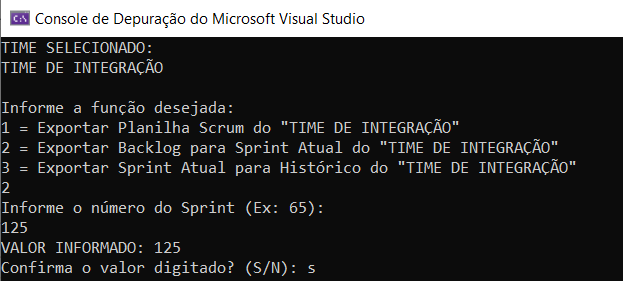
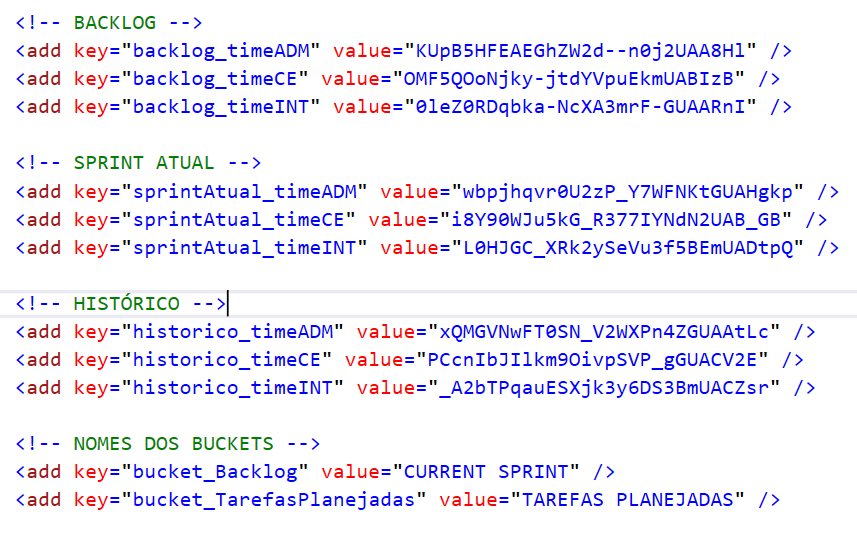

# Trabalho no Planner
- SE ATRIBUIR à tarefa em que começou a trabalhar (as tarefas são limpas durante a cópia do Backlog para o Sprint, embora as "previsões" de quem poderia pegar a tarefa tenham sido transcritas no final das notas
- ao iniciar uma tarefa mudar o PROGRESSO para INICIADA
- marcar os CHECKLISTs conforme for concluído
- informar ao SCRUM MASTER quando uma tarefa for concluída, para que ele possa mudar o progresso para CONCLUÍDO

Bem como:
- Registrar as tarefas extras no bucket "TAREFAS EXTRAS", colocando o número de PONTOS (quando for votado) ENTRE PARÊNTESES
- Registrar os Out Of Sprints no bucket "ATIVIDADES EXTRAS (OutOfSprints)" registrando a quantidade de HORAS ENTRE COLCHETES.

Além disso:

- As tarefas planejadas foram numeradas com S125.1, S125.2 etc. Ao efetuar um commit, copie o título da tarefa, incluindo a numeração dela, na mensagem do commit para facilitar futura referência
- No bucket "COMENTÁRIOS e REFERÊNCIA" já existe, para cada time, uma caixa de "REVIEW/RETROSPECTIVA". Conforme o sprint andar, quem tiver algo a registrar para discutir na reunião de revisão, já pode ir anotando ali na nota dessa task.

## Nova estrutura de Planos e Times dentro do Planner 

Após a migração do Trello para o Planner, e com a subdivisão de novos times, foi criada nova estrutura dentro do Planner. 

Cada time passará, portanto, a ter **4 planos cada um**:

- **Backlog:** Plano responsável por armazenar todas as tarefas do Backlog do time.

- **Sprint Atual:** Plano responsável por armazenar e manter o acompanhamento do Sprint do time.

- **Lixeira:** Plano responsável por ser uma espécie de "arquivo de tarefas" do time.

- **Histórico:** Plano responsável por armazenar o histórico de todos os sprints anteriores. 

No caso do **Plano de Histórico**, cada bucket do plano será reservado para um sprint. Para cada bucket do Sprint, foi feita a "conversão" dos buckets para labels no plano do histórico. Em outras palavras, será possível "ver uma foto" de cada sprint a partir das labels deste plano. 

## Exportação do Sprint e Histórico
Foi desenvolvido aplicativo exclusivo para Utilitários do TCMRio que utilizam a API do Microsoft Graph. Este aplicativo está em nosso GIT na URL: [http://git/asi/utilitarios_microsoft_graph](http://git/asi/utilitarios_microsoft_graph)

Após o final de cada Sprint e realização do Planning, deve-se:

1. Mover todo o plano do Sprint Atual para o Histórico de Sprints;
2. Mover todas as tarefas do "CURRENT SPRINT" do Backlog para as "Tarefas Planejadas" do Sprint Atual;

No aplicativo desenvolvido é possível executar cada um dos itens acima. **Porém, antes de executar os comandos, é preciso selecionar o time ao qual deseja.**

## Seleção do time dentro do App de Utilitários
A seleção dos time é feita via arquivo *App.config*. Basta alterar a chave **"time"** para o time que deseja. As opções são:

- **timeCE:** Time de Controle Externo
- **timeADM:** Time de sistemas Administrativos
- **timeINT:** Time de Integração

```xml
<?xml version="1.0" encoding="utf-8">
<configuration>
  <appSettings>
    <add key="time" value="timeINT"/>
```

Uma vez selecionado o time o qual deseja, basta selecionar a função desejada no aplicativo:



## Identificação e Configuração dos Planos e Buckets no App de Utilitários
O Aplicativo de Utilitários possui em seu arquivo de configuração (*App.config*) todas as chaves necessárias para execução das funções desejadas nos respectivos times já citados. 

Além de armazenar o **time atual selecionado** para executar as funções, o arquivo de configuração armazena também os IDs dos Planos de cada time e os nomes dos Buckets de "Backlog" e "Tarefas Planejadas". 

Estas informações indicam ao aplicativo de onde as tarefas são lidas e para onde deverão ser escritas. 



As chaves com os IDs de Planos já estarão configuradas e apontando para o time correto. 

**Você não deve, em hipótese alguma, alterá-las.**